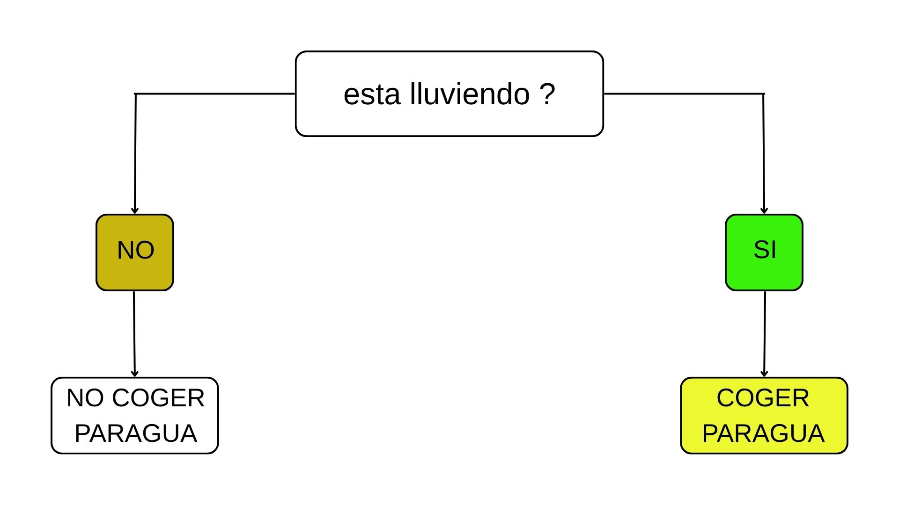
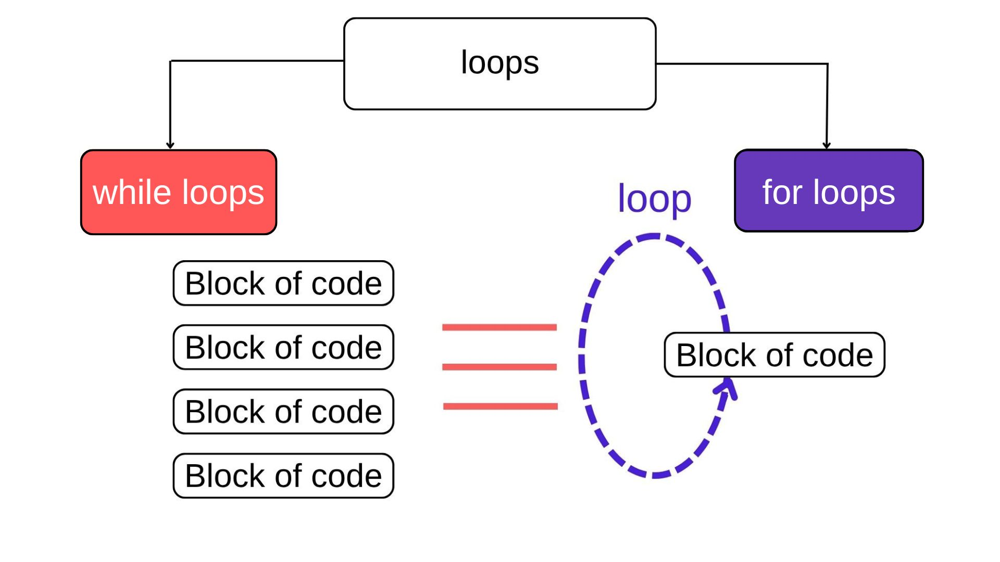
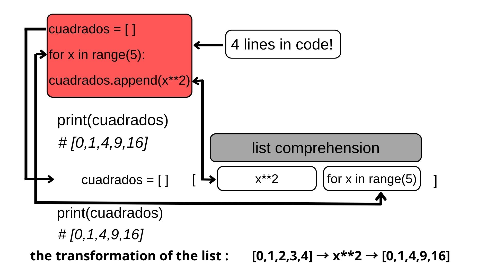
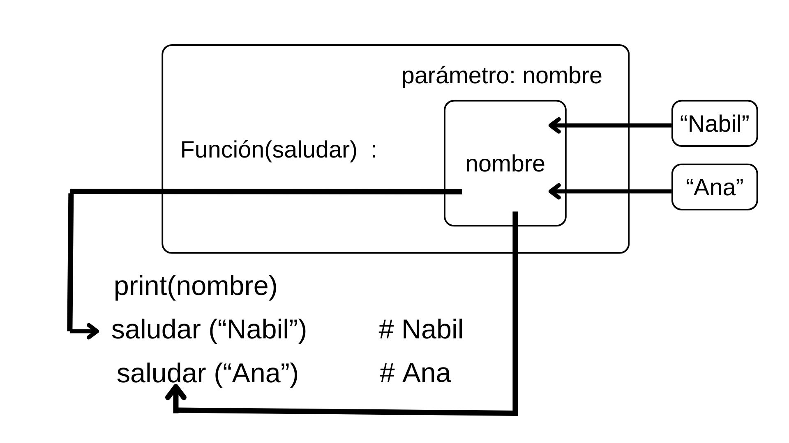
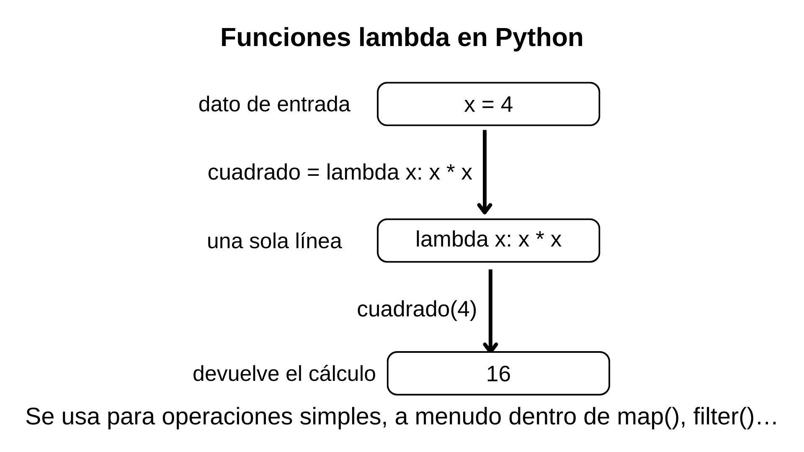
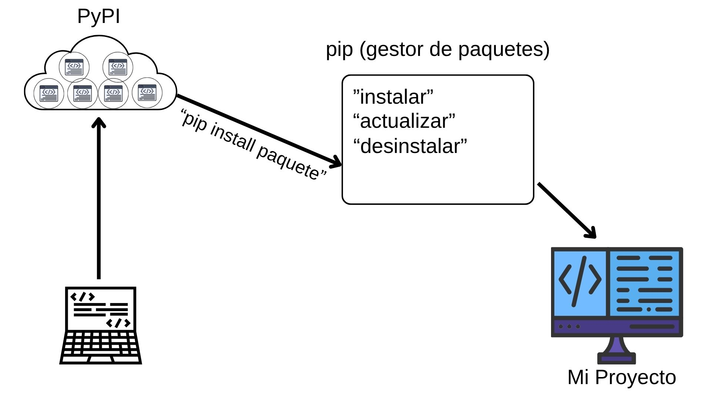

# Checkpoint 5 – Python básico

Documentación en lenguaje Markdown para principiantes sobre:
condicionales, bucles, listas por comprensión, argumentos, funciones lambda y pip.

Autor: Majid

Curso: Full Stack / Módulo Python

---

# ¿Qué son los **condicionales**?

**Los condicionales son estructuras de control que permiten que un programa tome decisiones basadas en ciertas condiciones.**

Estas sentencias evalúan expresiones y ejecutan **diferentes bloques de código** según si son **verdaderas** o **falsas**.

## 📚 **Explicación de `if` y `else`**



## 🔍 **Sentencia `if`**

La sentencia **`if`** ejecuta código **solo si** una condición es **verdadera**.

### **Sintaxis básica:**
```python
if condicion:
    # bloque de código si la condición es verdadera
```

### **Ejemplo práctico (lluvia):**
```python
esta_lluviendo = True

if esta_lluviendo:
    print("🟢 SÍ - Coger paraguas 💧")
```

**Resultado:** `🟢 SÍ - Coger paraguas 💧` ✅

## ❌ **Sentencia `else`**

La sentencia **`else`** ejecuta código **cuando la condición del `if` es falsa**.

### **Sintaxis completa:**
```python
if condicion:
    # código si es VERDADERO
else:
    # código si es FALSO
```

### **Ejemplo práctico (lluvia):**
```python
esta_lluviendo = False

if esta_lluviendo:
    print("🟢 SÍ - Coger paraguas 💧")
else:
    print("🟡 NO - No coger paraguas ☀️")
```

**Resultado:** `🟡 NO - No coger paraguas ☀️` ✅

## 🎯 **Ejemplo interactivo ejecutable**

[](pregunta1.ipynb)

# Pregunta 2 

# ¿Cuáles son los diferentes tipos de bucles en Python? ¿Por qué son útiles?

**Python tiene 2 bucles principales: for (itera secuencias conocidas) y while (repite mientras condición verdadera). Son útiles para automatizar repeticiones evitando código duplicado.**

# 📚 **Explicación con foto y ejemplo:**




- **Loops** (amarillo): Contenedor bucles
- **while** (rojo): Repite mientras condición
- **for** (azul): Itera secuencia fija

### 🌀 Tipos de bucles:

| Bucle | Cuándo usar | Ejemplo |
|-------|-------------|---------|
| `for` | Listas, rangos | `for i in range(5):` |
| `while` | Condición cambia | `while contador < 5:` |


### Sintaxis básica de `for` y `while`

```python
for letra in "Python":
    print(letra)
# P y t h o n
```

```python
contador = 1
while contador <= 5:
    print(contador)
    contador += 1
# 1 2 3 4 5
```


### 📊 Ejemplo `while` → paso a paso

```python
contador = 1          # INICIO: contador vale 1

while contador <= 5:  # PREGUNTA: ¿contador <= 5?
    print(contador)   # Imprime el valor actual
    contador += 1     # AUMENTA el contador en 1
```

**Iteraciones:**

1. ¿1 ≤ 5? → SÍ → imprime 1 → contador pasa a 2  
2. ¿2 ≤ 5? → SÍ → imprime 2 → contador pasa a 3  
3. ¿3 ≤ 5? → SÍ → imprime 3 → contador pasa a 4  
4. ¿4 ≤ 5? → SÍ → imprime 4 → contador pasa a 5  
5. ¿5 ≤ 5? → SÍ → imprime 5 → contador pasa a 6  
6. ¿6 ≤ 5? → NO → sale del bucle ✓  

**Salida en pantalla:** `1 2 3 4 5`

---

### 🔄 While paso a paso (resumen)

- `contador = 1` ← INICIO  
- `while contador <= 5` ← PREGUNTA en cada vuelta  
- `print(contador)` ← EJECUTA la acción  
- `contador += 1` ← AVANZA el contador (clave para no bucle infinito)  

---

### Ejemplo `for` con `break`

```python
for fruta in ["manzana", "banana", "sandía"]:
    if fruta == "sandía":
        break       # PARA el bucle
    print(fruta)    # manzana banana
```

💡 ¿Por qué útiles?

- Automatizan tareas repetitivas.  
- Evitan copiar el mismo código 100 veces.  

⚙️ Controladores útiles:

- `break`: sale del bucle inmediatamente.  
- `continue`: salta a la siguiente iteración.

---

## Resumen final de la Pregunta 2

En un **bucle `while`**, el programa repite un bloque de código mientras una condición general se cumpla; esa condición se comprueba en cada vuelta y decide si el bucle sigue o se detiene.

En un **bucle `for`**, primero elegimos la colección de elementos (lista, rango, texto…) y luego el mismo código se ejecuta para cada uno de esos elementos, uno detrás de otro.


[](pregunta2.ipynb)

## Pregunta 3

# ¿Qué es una lista por comprensión en Python?

Es una forma **CORTA** de crear listas con for en 1 línea. Sintaxis: [expresión for elemento in iterable]
Las comprensiones no solo son más concisas en sintaxis si no que, en ocasiones, también pueden ser más rápidas que las construcciones equivalentes usando bucles for.

# 📚 **Explicacion con foto y ejemplos:**


# Tabla resumen:
| Ejemplo | LARGO | COMPRENSIÓN |
|---------|-------|-------------|
| Cuadrados | 6 líneas | **1 línea** |
| Pares | **5 líneas** | **1 línea** |
| Mayúsculas | 5 líneas | **1 línea** |
| Grandes | **6 líneas** | **1 línea** |

# 📝 Fórmula mágica:
La estructura general de una list comprehension es:

[QUÉ_HACER for elemento in DONDE_BUSCAR]

## ❌ Cuadrados - FORMA LARGA

 ```python
cuadrados = []
for x in range(5):
    cuadrados.append(x**2)
print(cuadrados)  # [0,1,4,9,16]
```
## ✅ Cuadrados - LISTA COMPRENSIÓN (versión corta):
```python
cuadrados = [x**2 for x in range(5)]
print(cuadrados)  # [0,1,4,9,16] ✓
```

## ❌ Pares - FORMA LARGA:
```python
pares = []
for x in range(10):
    if x % 2 == 0:
        pares.append(x)
print(pares)  # [0, 2, 4, 6, 8]
```
## ✅ Pares - LISTA COMPRENSIÓN (versión corta) :

```python
pares = [x for x in range(10) if x % 2 == 0]
print(pares)  # [0, 2, 4, 6, 8] ✓
```
## ❌ Mayúsculas - FORMA LARGA:
```python
mayus = []
for l in "python":
    mayus.append(l.upper())
print(mayus)  # ['P', 'Y', 'T', 'H', 'O', 'N']
```
## ✅ Mayúsculas - LISTA COMPRENSIÓN (versión corta):
```python
mayus = [l.upper() for l in "python"]
print(mayus)  # ['P', 'Y', 'T', 'H', 'O', 'N'] ✓
```
## ❌ Solo grandes - FORMA LARGA:
```python
grandes = []
for x in [1,5,3,8,2]:

    if x > 5:
        grandes.append(x)
print(grandes)  # [8]
```
## ✅ Solo grandes - LISTA COMPRENSIÓN(versión corta) :
```python
grandes = [x for x in [1,5,3,8,2] if x > 5]
print(grandes)  # [8] ✓
```
[](pregunta3.ipynb)

## Pregunta 4 

# ¿Qué es un argumento en Python?

En Python, un argumento es el dato que le pasamos a una función cuando la llamamos, para que esa función pueda trabajar con él.
Gracias a los argumentos, una misma función se puede reutilizar con valores diferentes sin cambiar su código.

# 📚 **Explicacion con foto y ejemplos:**



## 📚 Ejemplo simple

```python
def saludar(nombre):
    print("Hola,", nombre)
saludar("Nabil")    # Hola Nabil
saludar("Ana")      # Hola Ana
```
Aquí nombre es el parámetro de la función (la “variable interna”).

"Nabil" y "Ana" son los argumentos que pasamos al llamar a la función.

## 🔢 Ejemplo con número

```python
def doble(numero):
    print("El doble es:", numero * 2)
doble(5)   # El doble es: 10
doble(12)  # El doble es: 24
```

Aquí `numero` es el parámetro de la función, y `5` y `12` son los argumentos que le pasamos al llamar a `doble()`.

## 🧾 Mini tabla resumen
 
| Concepto | Dentro de la función   | Al llamar la función              |
|---------|------------------------|-----------------------------------|
| Nombre  | Parámetro (`nombre`)   | Argumento (`"Nabil"`, `"Ana"`)    |
| Numero  | Parámetro (`numero`)   | Argumento (`5`, `12`)    |
| Para qué| Recibe el dato         | Valor que enviamos a la función   |

 ## Resumen: diferencia parámetro vs argumento

El argumento es el valor que entra a la función y el parámetro es el nombre del lugar donde se guarda ese valor dentro de la función.
Dentro de la función trabajamos siempre con el parámetro, no con el valor en sí, y por eso reconocemos al argumento por el lugar donde se guarda. No vemos directamente el argumento, sino la posición o etiqueta (el parámetro) donde lo colocamos.

[](pregunta4.ipynb)

## Pregunta 5

# ¿Qué es una función Lambda en Python?


En Python, una **función lambda** es una función pequeña y sin nombre (anónima) que se escribe en una sola línea.  
Se usa cuando necesitamos una función rápida y sencilla, normalmente de forma temporal o como argumento de otra función.


# 📚 **Explicacion con foto y ejemplos:**



## 🧠 Sintaxis básica

```python
lambda parametros: expresion
```

- `parametros`: los valores que recibe.  
- `expresion`: lo que calcula y devuelve (no lleva `return` escrito).

## 📚 Ejemplos

### Cuadrado de un número

```python
# cuadrado de un número
cuadrado = lambda x: x * x
print(cuadrado(4))   # 16
```

### Suma de dos números

```python
# suma de dos números
suma = lambda x, y: x + y
print(suma(3, 5))    # 8
```

Se usan mucho junto con `map()`, `filter()` o `reduce()` cuando queremos pasar una operación simple sin definir una función normal con `def`.

## 💡 Para recordar

- Lambda = “¿qué operación quiero hacer sobre un dato?”.  
- Solo permite **una expresión** (no varias líneas de código).  
- Si se abusa de lambdas, el código puede ser más difícil de leer y de depurar.

[](pregunta5.ipynb)

## Pregunta 6

# ¿Qué es un paquete pip?

En Python, pip es el gestor de paquetes oficial del lenguaje y
Permite instalar paquetes externos desde PyPI, que es el repositorio oficial de paquetes de Python.
Sirve para instalar, actualizar y desinstalar paquetes (librerías) de Python de forma sencilla desde la terminal.

Un paquete es un conjunto de módulos y funciones que otros programadores han creado y publicado para que podamos reutilizarlos en nuestros proyectos.

# **📚 Explicacion con foto y ejemplos:**



## Instalación de pip

El proceso de instalación utiliza Python puro. Accede a esta página: https://bootstrap.pypa.io/get-pip.py  
En la mayoría de instalaciones modernas de Python, pip ya viene incluido por defecto.

Ejemplos de uso básico de pip (desde la terminal):

```bash
pip install requests      # instalar un paquete
pip uninstall requests    # desinstalar un paquete
pip list                  # ver paquetes instalados
```